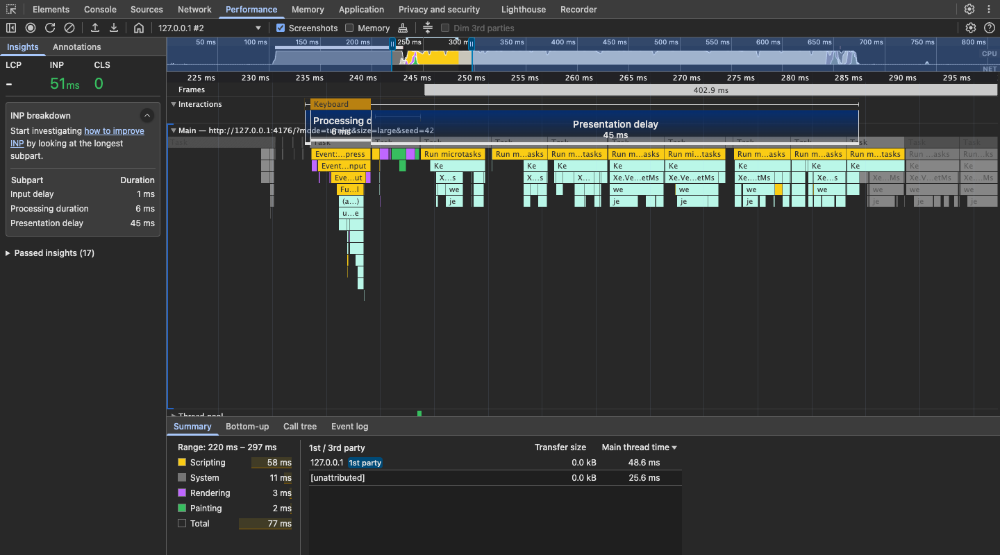

# Turnlet

**Small turns. Responsive interfaces.**

[](https://github.com/leracherry/turnlet/actions/workflows/ci.yml)

Process arrays in small, cooperative chunks—giving the browser opportunities to handle input and paint between turns. Two functions, stable ordering, cancellation, and no runtime dependencies.

[npm](https://www.npmjs.com/package/turnlet) · [Try the demo](#try-it-locally) · [API guide](docs/api.md) · [Case study](docs/case-study.md) · [Documentation](docs/README.md)

## Inside a browser turn

A real Chrome DevTools recording of Turnlet searching **50,000 products**. The expanded INP insight reveals the input handler and the smaller tasks that follow it.



Same scorer, different scheduling: [inspect the blocking trace and download both recordings](docs/media/README.md#chrome-performance-recordings). Captured locally at 4× CPU slowdown; each panel is zoomed to its own interaction. These individual recordings illustrate scheduling, not a repeatable speedup. [Controlled case study →](docs/case-study.md)

## Install

```sh
npm install turnlet
```

ESM-only, with TypeScript declarations and no runtime dependencies.

## The idea

A long synchronous loop occupies the main thread until it finishes. Turnlet yields before starting, then between chunks when its time budget is reached:

```text
Plain loop   work ─────────────────────────────── done
Turnlet      yield ─ work ─ yield ─ work ─ yield ─ work ─ done
```

The work stays on the main thread. Callbacks run one at a time, in input order.

## Two functions

| Function          | Use it to                                  | Resolves with           |
| ----------------- | ------------------------------------------ | ----------------------- |
| `mapInChunks`     | Transform each item                        | An ordered result array |
| `forEachInChunks` | Perform work without a mapped output array | `void`                  |

```ts
import { mapInChunks, forEachInChunks } from 'turnlet';

const doubled = await mapInChunks([2, 4], (value) => value * 2);
// [4, 8]

let total = 0;
await forEachInChunks([2, 4], (value) => {
  total += value;
});
// total === 6
```

Both accept an optional `{ budgetMs, signal }`. The default budget is **5 ms**; valid budgets are finite numbers greater than 0 and at most 50. An `AbortSignal` cancels pending and future work once observed.

For a practical integration, see the [cancellable record-validation recipe](examples/record-validation/README.md). It handles errors and prevents older requests from overwriting newer results.

## Try it locally

Use **Node.js 22.23.2** (see [.nvmrc](.nvmrc)):

```sh
git clone git@github.com:leracherry/turnlet.git
cd turnlet
npm ci
npm run dev
```

Open the URL printed by Vite. Search for **lamp**, **forest mug**, or **ceramix** to try typo matching.

Choose **Blocking** or **Turnlet**, select a workload, then **Apply and restart**. Both modes use the same seeded catalogue and scorer; Turnlet yields and cancels superseded searches.

The demo shows two different clocks:

- **Session INP candidate:** interaction responsiveness during this page visit.
- **Search completion:** handler entry through the latest accepted results DOM update—not final paint.

[Demo guide](docs/demo.md) · [Walkthrough](docs/media/README.md)

## Know the tradeoffs

- Callbacks must be synchronous. One expensive callback can exceed the whole budget.
- Cancellation cannot interrupt a running callback or undo its side effects.
- Keep the input and relevant item contents unchanged until the operation settles.
- Small workloads may finish sooner with a plain loop.
- Each operation has its own budget; there is no global scheduling policy.

Turnlet creates scheduling opportunities, **not a guaranteed INP score**. In the [local case study](docs/case-study.md), its live INP candidates were lower, but searches took longer to complete. The report includes raw observations, one failed trial, and the limits of that comparison.

## Documentation

| Start here                                  | What you will find                                  |
| ------------------------------------------- | --------------------------------------------------- |
| [API guide](docs/api.md)                    | Usage, cancellation, errors, and alternatives       |
| [API contract](docs/api-contract.md)        | Exact guarantees and edge cases                     |
| [Demo guide](docs/demo.md)                  | Controls, search behavior, and measurement meanings |
| [Case study](docs/case-study.md)            | Results, raw evidence, and engineering tradeoffs    |
| [Measurement protocol](docs/methodology.md) | Repeatable experiments                              |
| [Release checklist](docs/release.md)        | Package review, publishing, and deployment          |

## Development

Run from the repository root:

```sh
npm run typecheck
npm run lint
npm test
npm run build
```

For the browser and package gates:

```sh
npx playwright install chromium firefox webkit
npm run test:browser
npm run test:demo
npm run test:pages
npm run test:package
```

`npm test` includes unit tests, executable usage examples, and evidence checks. Browser tests cover Chromium, Firefox, WebKit, the production demo, and its hosting path. The package gate installs and tests a real tarball in a clean consumer.

Source: [library](packages/turnlet) · [demo](apps/demo) · [validation recipe](examples/record-validation)

[MIT license](LICENSE) · [Changelog](CHANGELOG.md)
