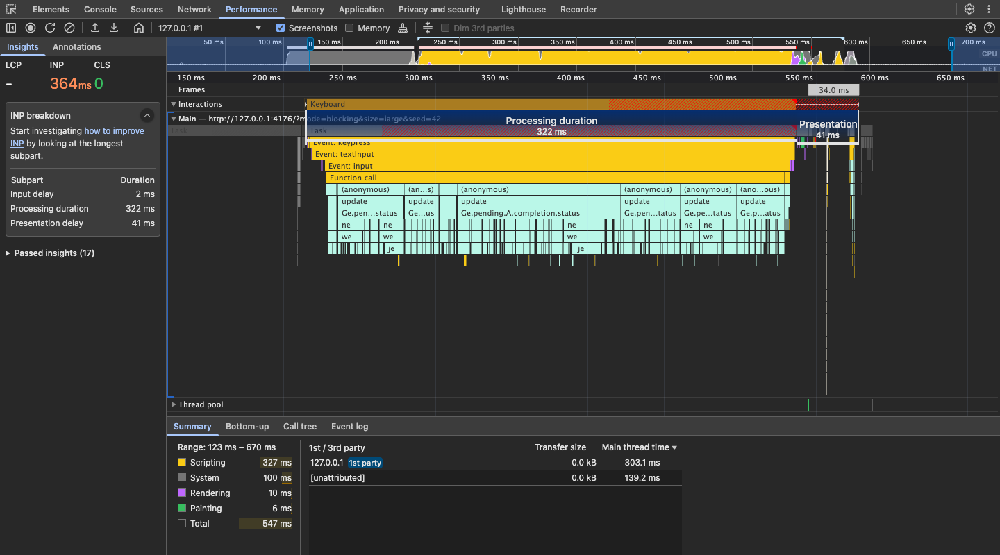
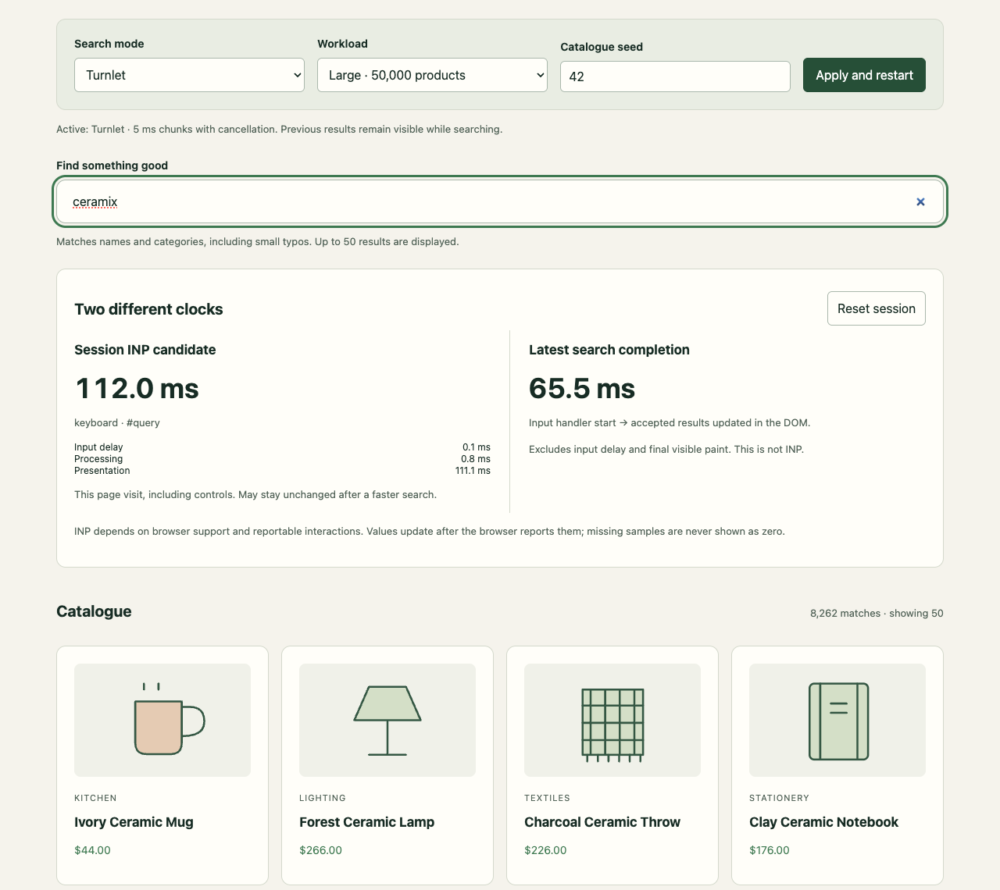
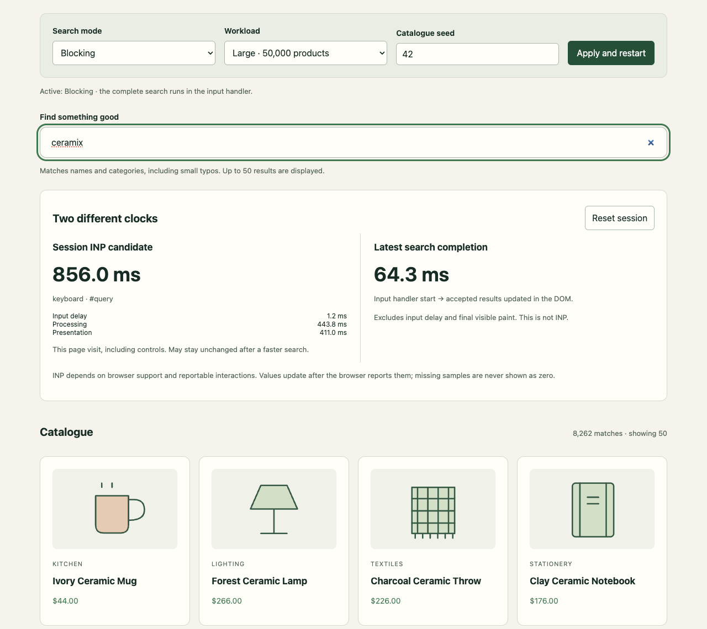

# Performance recordings and playground walkthrough

[← Demo guide](../demo.md)

## Chrome performance recordings

These are screenshots of **Chrome DevTools itself**, with the Performance panel’s INP breakdown expanded. The underlying recordings come from the production Turnlet demo, using the same scorer, 50,000 products, seed 42, and a final query of `ceramix`.

### Turnlet: work across tasks


### Blocking: work inside the input handler



Chrome automatically zooms each panel to its interaction when the INP insight opens. **The horizontal scales differ.** The Turnlet detail shows the interaction and early chunks, not the entire search. The raw recordings include the rest of the work. The numbers in the INP insight and selected-range summary describe different boundaries.

[Download Turnlet trace](performance-turnlet.json) · [Download Blocking trace](performance-blocking.json)

Save either JSON file, open Chrome DevTools → **Performance → Load trace**, and expand **INP breakdown**. These are actual trace events; only the launch-command metadata containing local filesystem paths has been removed.

Capture conditions: Chrome for Testing **145.0.7632.6**, headless, macOS **26.6.2**, 1440 × 1000 demo viewport, **4× CPU slowdown**, localhost without network throttling. Each mode starts in a fresh browser context. The script focuses the input, lets the page settle, sets the prefix `cerami` without starting a search, then records one browser-dispatched `x` keystroke through search completion. DevTools screenshots use its dark theme at 1440 × 800.

These instrumented, single-session recordings illustrate task structure. They are separate from the [case study](../case-study.md), which used repeated trials without tracing. Do not interpret these screenshots as a guaranteed INP improvement or an equal-scale completion-time comparison.

To reproduce, start the production preview as described below, then run:

```sh
npx playwright install chromium
node scripts/capture-performance.mjs
```

`DEMO_URL` and `CHROMIUM_PATH` are optional overrides. Set `RENDER_ONLY=1` to reopen the saved traces and recreate screenshots without recording new work. DevTools layout and automatic zoom can vary between Chrome versions. Run captures separately from benchmarks.

## Real search screenshots

These unedited Chromium screenshots show the production demo searching `ceramix` across 50,000 products, seed 42. Both modes use the same scorer and show the same final ranked products.

### Turnlet



### Blocking



These are separate unthrottled local sessions, typed at 120 ms per character. The live metrics describe those visits; they are not paired benchmark trials or the case study measurements. No metric values or UI content were replaced for the screenshots.

To recreate, build and serve the production demo:

```sh
npm run build
npm run preview --workspace @turnlet/demo -- --host 127.0.0.1 --port 4176 --strictPort
```

In another terminal:

```sh
npx playwright install chromium
node scripts/capture-screenshots.mjs
```

Optionally set `DEMO_URL` for another preview origin or `CHROMIUM_PATH` for an installed Chromium executable. Captures use a 1280 × 1140 viewport and reduced motion, and wait for completed results. Live values will vary. Do not capture while running measurement trials.

## Video walkthrough

[Watch the walkthrough](walkthrough.webm) · WebM, 1280 × 900

The recording visits Blocking and Turnlet modes, searches for `ceramix`, inspects both clocks, shows a no-match state, and ends with the integration example.

It is an orientation clip, **not a benchmark trial**. Recording is unthrottled, includes setup/control interactions, and uses slower typing than the rapid-input protocol. Values shown are live readings from that recorded visit, not the published experiment.

To recreate, serve a production build on port 4176 and run:

```sh
node scripts/record-demo.mjs
```

Do not run recording concurrently with measurement trials.
